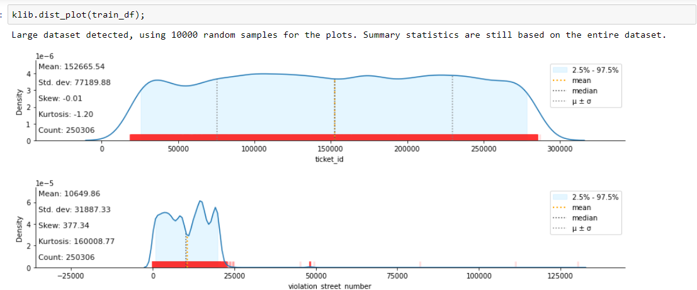
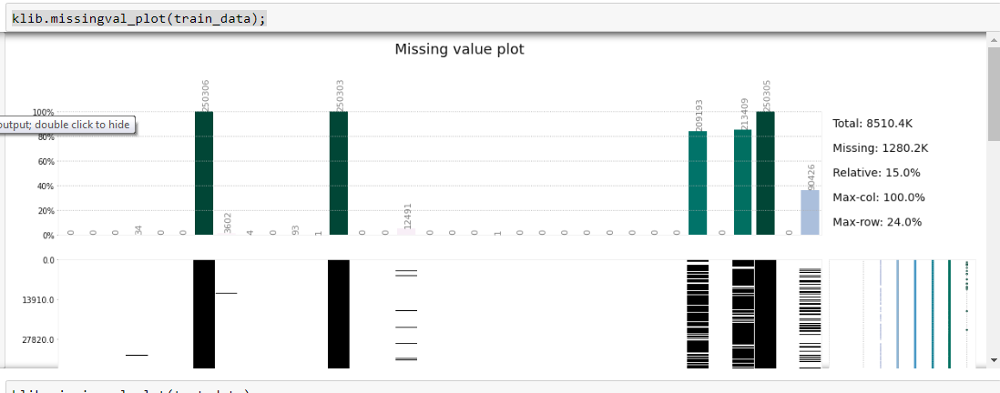
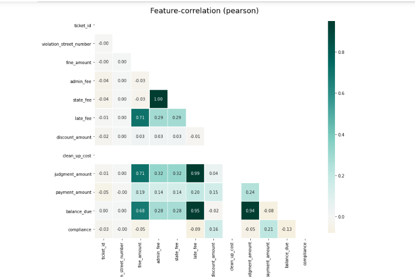

# Predicting Property Maintenance Fines
The city of Detroit issues millions of dollars Blight violation fines every year to individuals who leave their properties to remain in a deteriorated condition. However many of those fines remain unpaid. In order to avoid the costly and tedious process of enforcing the unpaid blight fines, the city wants to know how to increase the blight ticket compliance. The task of this problem is to predict whether a given blight ticket will be paid on time using data from Detroit Open data Portal.
This project is focused on supervised machine learning model therefore considered training data sets with known compliance where  some tickets are paid early, on time, or within a month of the hearing date, and other paid after hearing date or no paid at all or violator found not responsible. After understanding the features of training data and choosing correct machine learning model, the prediction has made on the test data set whether those will be paid on time or not. This is a binary classification problem 

Following steps were implemented in this project:
1.	Exploratory Data Analysis
    Understanding training data, given features and cleaning data,  
    
    
    
2.	Feature engineering
Selecting important features and transforming.  Label Encoder was used to convert categorical text data into model understandable numerical data.  There are multiple numbers which confuses the model thinking that data with some kind of order. Therefore these label encoded data into One Hot Encoder. One hot encoder splits a column into multiple columns and numbers are changed into 1s and 0s depending on which column has what value. 
  
3.	Model fitting
Cleaned and transformed data were fitted and compared by GradientBoost Decision Tree and Random Forest Classifiers. The model to predict on test set was picked based on the best AUC score. 

4.	Evaluation
The compliance for the test data set was predicted as probability values. 

